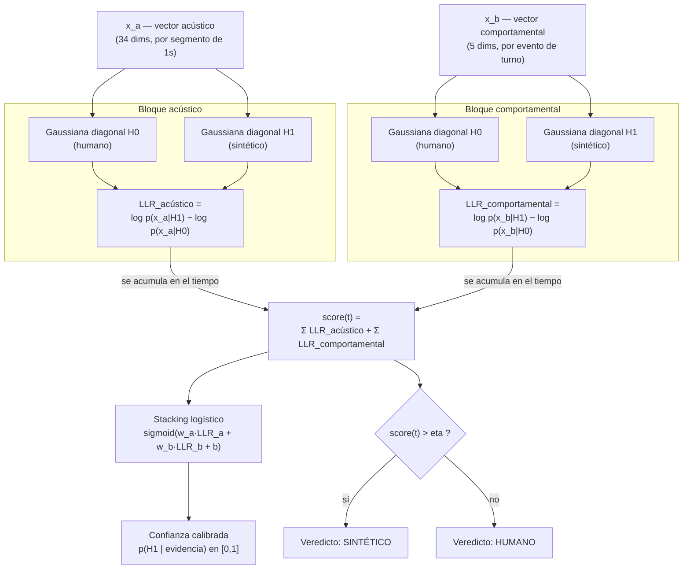
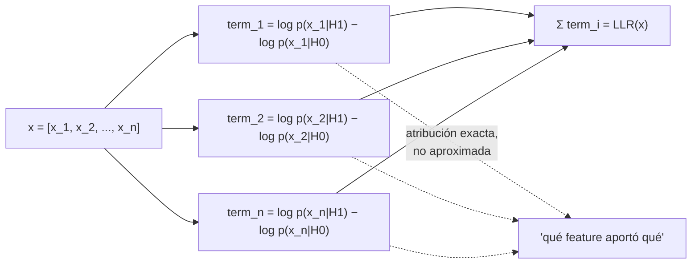

# Detector de Voz Sintética — Fundamento del modelo

Este repositorio contiene **únicamente el núcleo de modelado y entrenamiento**
del detector de voz sintética: la extracción de features, las densidades
estadísticas, el test de razón de verosimilitud, la calibración y el script
que entrena y serializa el binario (`model.pkl`). No incluye API ni
dashboard — solo lo necesario para entender, entrenar y reutilizar el
modelo en cualquier otro sistema.

Este documento explica el **fundamento teórico**: qué problema se resuelve,
qué supuestos estadísticos se hacen y por qué se tomó cada decisión de
diseño. Los otros README de este repo cubren aspectos complementarios:

| Archivo | Contenido |
|---|---|
| `README.md` (este) | Fundamento matemático y teórico del modelo |
| `README_PROCESAMIENTO.md` | Cómo se procesan los datos, de audio crudo a decisión |
| `README_EJECUCION.md` | Cómo instalar, entrenar y usar el modelo paso a paso |
| `README_INPUTS_OUTPUTS.md` | Contrato exacto de entradas/salidas de cada módulo |
| `README_IMPLEMENTACION.md` | Qué carpetas se necesitan en producción vs. solo en entrenamiento, y cómo integrar/desplegar el detector |
| `README_COMMITS.md` | Cómo versionar el proyecto en commits separados y subirlo a GitHub |

---

## Diagrama general del modelo

Cómo se combinan los dos bloques de evidencia (acústico y comportamental)
para llegar a una decisión final. Cada caja de este diagrama se explica en
detalle en las secciones siguientes.



## 1. Planteamiento del problema

Dada una llamada telefónica estéreo (canal 0 = caller, canal 1 = agente),
se quiere decidir si el caller es una **voz humana** (H0) o una **voz
sintética generada por un modelo de texto-a-voz / conversión de voz**
(H1), de forma:

- **Interpretable**: cada decisión debe poder explicarse feature por
  feature, no como una caja negra.
- **Incremental**: la decisión se puede tomar (y refinar) conforme avanza
  la llamada, no solo al final.
- **Actualizable**: el modelo debe poder incorporar nuevas llamadas
  etiquetadas sin reentrenar desde cero.

## 2. Test de razón de verosimilitud (Neyman-Pearson)

El núcleo estadístico es un **test de hipótesis clásico**. Para un vector
de evidencia `x` (features acústicas o comportamentales) se define el
log-likelihood-ratio (LLR):

```
LLR(x) = log p(x | H1) - log p(x | H0)
```

y se decide H1 (sintético) si `LLR(x) > eta`, donde `eta` es un umbral
elegido en validación. Este es exactamente el test de Neyman-Pearson: para
un nivel de falsos positivos fijo, es el test más potente posible dado el
modelo de las densidades `p(x|H0)` y `p(x|H1)`.

El sistema no evalúa un único LLR global, sino que **descompone la
evidencia en dos bloques condicionalmente independientes** — acústico
(`x_a`) y comportamental (`x_b`) — y sus LLR se acumulan por separado a lo
largo del tiempo:

```
score(t) = LLR_acústico_total(t) + LLR_comportamental_total(t)
```

## 3. Densidades: gaussianas diagonales (naive Bayes gaussiano)

Para cada bloque y cada hipótesis se modela `p(x|H)` como una **gaussiana
multivariada con covarianza diagonal**, es decir, se asume independencia
condicional entre las dimensiones del vector de features dentro de un
mismo bloque:

```
log p(x|H) = sum_i [ -1/2 log(2*pi*sigma_i^2) - (x_i - mu_i)^2 / (2*sigma_i^2) ]
```

`mu_i` y `sigma_i^2` se estiman por máxima verosimilitud (media y varianza
muestral) sobre las llamadas de entrenamiento de cada clase.

**Por qué covarianza diagonal y no completa:**
- La matriz inversa de covarianza `Sigma^-1` solo se necesitaría calcular
  una vez en entrenamiento (nunca en el loop de inferencia — la latencia
  real está en la extracción de features, no en evaluar la gaussiana), así
  que el ahorro computacional no es la razón principal.
- Es mucho más estable con pocos cientos de llamadas: una covarianza
  completa de ~30 dimensiones (bloque acústico) requeriría estimar
  ~465 parámetros extra con datos limitados, lo que generaría matrices
  mal condicionadas.
- Es la **unidad mínima de interpretabilidad**: al ser diagonal, cada
  feature `i` aporta un término aditivo propio al log-likelihood, y por lo
  tanto al LLR. Esto permite la **atribución exacta** (no aproximada tipo
  SHAP) que se describe abajo.

## 4. Atribución exacta por feature

Como el LLR de un bloque es una suma de términos independientes por
dimensión:

```
LLR(x) = sum_i [ log p(x_i|H1) - log p(x_i|H0) ]
```

cada sumando `log p(x_i|H1) - log p(x_i|H0)` es la **contribución exacta**
de esa feature individual a la decisión — no una aproximación. Esto es lo
que permite responder "¿qué feature específica empujó la decisión hacia
sintético, y cuánto?" en cualquier instante.



## 5. Stacking logístico (fusión de bloques)

Sumar `LLR_acústico` y `LLR_comportamental` con peso fijo 1.0 asume que
ambos bloques son igual de confiables, lo cual es una suposición fuerte.
En su lugar, se entrena un **stacking logístico** de 2 entradas:

```
p(H1 | x) = sigmoid(w_a * LLR_acústico_total + w_b * LLR_comportamental_total + b)
```

Los pesos `w_a`, `w_b`, `b` se ajustan por regresión logística sobre los
LLR (estandarizados) de las llamadas de entrenamiento. Esto:

- Aprende cuánto pesar cada bloque según qué tan informativo resultó ser
  en los datos reales, en vez de asumir peso igual.
- De paso **calibra** la probabilidad final (equivalente a Platt scaling),
  entregando una confianza interpretable en `[0,1]`.
- Sigue siendo 100% interpretable: solo 2 pesos + un bias sobre 2 números
  que a su vez se descomponen en atribuciones por feature.

Como fallback existe también una fórmula de posterior bayesiano directo
(`bayes_posterior`) a partir del score LLR total y el prior `p(H1)`, para
los casos donde el stacking no aplica.

## 6. Umbral de decisión (índice de Youden)

El umbral `eta` sobre el score LLR total se elige maximizando el **índice
de Youden** (`sensibilidad + especificidad - 1`) sobre la curva ROC
calculada en el split de validación. Esto balancea falsos positivos y
falsos negativos sin fijar de antemano una tasa de falsa alarma objetivo.

## 7. Actualización online (sin reentrenar desde cero)

Las gaussianas diagonales se pueden actualizar de forma **exacta** (no
heurística) cuando llegan nuevas llamadas etiquetadas, usando un **prior
conjugado Normal-Inverse-Gamma** por dimensión. Dado que la familia
Normal-Inverse-Gamma es conjugada de la verosimilitud gaussiana, el
posterior tras ver los nuevos datos tiene forma cerrada — no hace falta
volver a correr `train/fit_densities.py` sobre todo el histórico.

## 8. score(t) acumulado en el tiempo

Durante una llamada, cada segmento acústico de 1s y cada evento
comportamental (turno, interrupción, backchannel) va sumando su
contribución al `score(t)` conforme ocurre — sin esperar a que termine la
llamada. Si en un instante `t` todavía no ha ocurrido ningún evento de un
bloque, ese término simplemente no se suma (no se imputa evidencia
faltante): el LLR sigue siendo válido con la evidencia disponible hasta
ese momento.

## 9. Decisiones de diseño adicionales

- **Fusión de turnos consecutivos del mismo canal**: un VAD/diarizador
  real fragmenta una intervención larga en varios turnos separados por
  micro-pausas; se fusionan antes de clasificar eventos, para no contar
  cada fragmento como una reacción distinta.
- **Ambos canales se usan para diarizar**: el bloque comportamental
  necesita canal 0 y canal 1 para saber a qué estaba reaccionando el
  caller (interrupciones, silencios, solapes del agente). El canal del
  agente nunca se usa para extraer features acústicas del caller, solo
  para la diarización de turnos.
- **Separación train/val por llamada, no por segmento**: evita filtrar
  información entre splits (varios segmentos de la misma llamada son muy
  parecidos entre sí).

## 10. Aumento de datos (augmentación) sin inventar llamadas

Con un dataset de un par de cientos/miles de llamadas, el modelo puede
sobreajustarse a las condiciones de grabación concretas de esas llamadas
(un micrófono, una red, un nivel de ruido de fondo) en vez de aprender lo
que realmente distingue voz humana de sintética. La respuesta NO es
generar llamadas falsas (contenido, hablantes o texto que no existen —
eso introduciría información fabricada), sino generar variantes
realistas de CANAL/ENTORNO de las llamadas reales ya etiquetadas: ruido a
distinto SNR, ancho de banda tipo telefonía fija, códec mu-law, pérdida
de paquetes VoIP, reverberación leve, cambios de ganancia
(`preprocessing/augmentation.py`).

Dos reglas de diseño no negociables:

- **Solo se perturba canal/entorno, nunca la voz en sí.** No se usa
  pitch-shift ni time-stretch: esas transformaciones alterarían
  jitter/shimmer y la coherencia de fase armónica, que son justo las
  features que el sistema usa para distinguir humano de sintético.
  Augmentar así podría borrar la señal que se quiere detectar.
- **Las variantes nunca se usan para validar, solo para entrenar cada
  fold**, y comparten el `group_id` de la llamada original para el
  shrinkage de varianza (sección 3.1 de este documento): se tratan como
  más evidencia de la MISMA llamada, no como llamadas independientes
  nuevas — si se contaran como independientes, la varianza estimada entre
  llamadas se subestimaría, exactamente el sesgo que ese shrinkage existe
  para evitar.

## 11. Validación cruzada repetida (estabilidad, no "más épocas")

Este modelo no se entrena por descenso de gradiente — no hay "épocas" que
iterar. La forma correcta de "iterar más" aquí es repetir la validación
cruzada con particiones distintas del dataset y ver qué tan estable es el
resultado. Cada repetición es un k-fold estratificado por llamada
independiente (semilla distinta) que cubre el 100% de las llamadas
exactamente una vez (out-of-fold). El score final por llamada es el
promedio entre repeticiones, y se reporta además la media ± desviación
estándar del AUC de cada repetición individual: esa desviación es la
métrica de estabilidad real. Un AUC alto en una sola partición no dice
nada si esa misma métrica se mueve mucho de una partición a otra — con
cientos de llamadas eso es exactamente lo que puede pasar, y reportarlo
explícitamente evita una falsa sensación de certeza.

Junto con esto se reportan métricas de calibración (Brier score, ECE) y
un intervalo de confianza por bootstrap del AUC (remuestreo por llamada):
el producto entrega una CONFIANZA en [0,1], no solo un veredicto binario,
así que qué tan honesta es esa confianza importa tanto como el accuracy.

## 12. Extensiones no incluidas (fuera de alcance de este repo)

- Bloque semántico (requeriría ASR + comparación de consistencia).
- Bloque de canal/telefonía (artefactos de doble compresión, piso de
  ruido anormalmente limpio).

Ambos quedarían documentados como un tercer bloque aditivo más al
`score(t)`, con la misma arquitectura de `BlockDensityModel` +
acumulador de score, sin tocar el resto del sistema.
