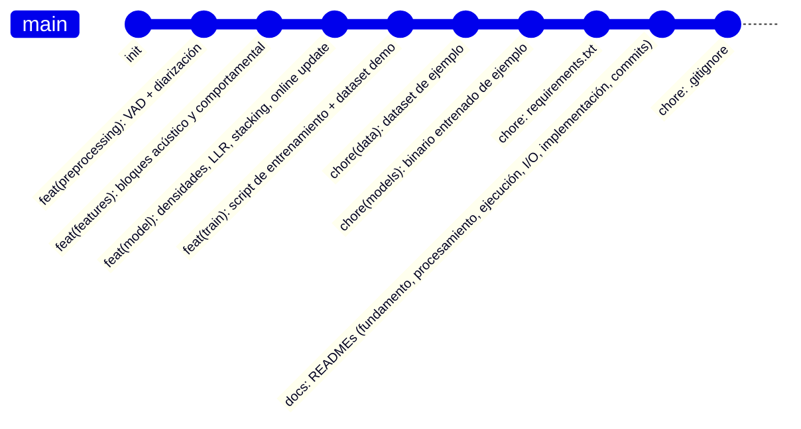

# Cómo versionar y subir el proyecto a GitHub

Guía para inicializar el repositorio, dividir el trabajo en commits
separados y lógicos (en vez de un solo commit gigante), y subirlo a
GitHub.

## Diagrama del historial de commits sugerido



## 1. Inicializar el repositorio

```bash
cd detector
git init
git branch -M main
```

Crea un `.gitignore` antes del primer commit para no subir entornos
virtuales ni archivos temporales:

```bash
cat > .gitignore << 'EOF'
.venv/
__pycache__/
*.pyc
.DS_Store
*.egg-info/
reports/
EOF
```

> Nota: `models/model.pkl` y `data/train/*.wav` se incluyen a propósito en
> este repo como ejemplo/demo. Si tu dataset real pesa mucho, considera
> usar [Git LFS](https://git-lfs.com/) para los `.wav` y `.pkl`, o mover
> `data/train/` a almacenamiento externo y dejar solo un `README` que
> explique cómo obtenerlo.
>
> `reports/` (las gráficas PNG del entrenamiento) se regeneran cada vez
> que corres `train/fit_densities.py`, así que normalmente no se
> versionan — quedan en `.gitignore`. Si quieres conservar el reporte de
> una corrida específica (ej. para adjuntarlo a un PR), quita esa línea
> del `.gitignore` o copia esa carpeta con otro nombre antes del commit.

## 2. Plan de commits separados

En vez de un `git add .` + un solo commit, conviene dividir el historial
por área funcional, para que quede claro qué hace cada pieza y sea fácil
de revisar:

```bash
# 1) Preprocesamiento (VAD + diarización)
git add preprocessing/
git commit -m "feat(preprocessing): VAD por energía y diarización estéreo"

# 2) Extracción de features
git add features/
git commit -m "feat(features): bloques acústico (x_a) y comportamental (x_b)"

# 3) Núcleo del modelo (densidades, LLR, calibración, online update, pipeline)
git add model/
git commit -m "feat(model): densidades gaussianas diagonales, LLR, stacking y actualización online"

# 4) Entrenamiento
git add train/
git commit -m "feat(train): script de entrenamiento y generador de dataset demo"

# 5) Dataset de ejemplo
git add data/
git commit -m "chore(data): dataset de ejemplo (demo, no son voces reales)"

# 6) Binario de ejemplo entrenado
git add models/
git commit -m "chore(models): binario de ejemplo entrenado con el dataset demo"

# 7) Dependencias
git add requirements.txt
git commit -m "chore: dependencias de modelo y entrenamiento"

# 8) Documentación
git add README.md README_PROCESAMIENTO.md README_EJECUCION.md README_INPUTS_OUTPUTS.md README_IMPLEMENTACION.md README_COMMITS.md
git commit -m "docs: fundamento del modelo, procesamiento, ejecución, inputs/outputs, implementación y guía de commits"

# 9) .gitignore (si no lo incluiste en el primer commit)
git add .gitignore
git commit -m "chore: agregar .gitignore"
```

Puedes ajustar el orden o agrupar distinto, pero la idea general es:
**cada commit debe poder explicarse en una frase y afectar un solo tipo de
cosa** (una capa del pipeline, los datos, la documentación, etc.), no
mezclar features de modelo con cambios de documentación en el mismo
commit.

## 3. Crear el repositorio en GitHub y subirlo

1. Crea un repositorio vacío en GitHub (sin README/licencia/gitignore
   generados automáticamente, para no chocar con el historial local):
   - Desde la web: `New repository` → nombre (ej. `detector-voz-sintetica`)
     → **no** marcar "Add a README file".
   - O desde la terminal con GitHub CLI:
     ```bash
     gh repo create detector-voz-sintetica --private --source=. --remote=origin
     ```
2. Si lo creaste desde la web, conecta el remoto manualmente:
   ```bash
   git remote add origin https://github.com/<tu_usuario>/detector-voz-sintetica.git
   ```
3. Sube todos los commits:
   ```bash
   git push -u origin main
   ```

## 4. Convenciones sugeridas para commits futuros

Usar [Conventional Commits](https://www.conventionalcommits.org/) facilita
generar changelogs y entender el historial de un vistazo:

- `feat:` nueva funcionalidad (ej. una feature nueva, un módulo nuevo).
- `fix:` corrección de un bug.
- `docs:` cambios solo de documentación.
- `chore:` tareas de mantenimiento (dependencias, configuración, datos).
- `refactor:` cambio interno que no altera el comportamiento observable.
- `test:` agregar o corregir pruebas.

Ejemplo para un cambio futuro en el modelo:
```bash
git commit -m "fix(model): corregir piso de varianza en DiagonalGaussian para evitar log(0)"
```

## 5. Mapa de documentación del repo

Para que el equipo sepa dónde buscar cada tipo de información antes de
abrir un PR o revisar un commit:

| Archivo | Contenido |
|---|---|
| `README.md` | Fundamento matemático y teórico del modelo |
| `README_PROCESAMIENTO.md` | Cómo se procesan los datos, de audio crudo a decisión |
| `README_EJECUCION.md` | Cómo instalar, entrenar y usar el modelo paso a paso |
| `README_INPUTS_OUTPUTS.md` | Contrato exacto de entradas/salidas de cada módulo |
| `README_IMPLEMENTACION.md` | Qué carpetas se necesitan en producción vs. solo en entrenamiento, y cómo integrar/desplegar el detector |
| `README_COMMITS.md` (este) | Cómo versionar el proyecto en commits separados y subirlo a GitHub |
