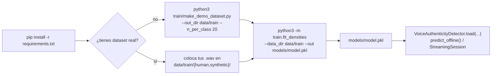

# Cómo ejecutar

Guía práctica para instalar dependencias, entrenar el modelo y usarlo
desde código. Este repo solo contiene el modelo y el entrenamiento (sin
API ni dashboard), así que todo el uso es vía Python.

## Diagrama de flujo de comandos



## 1. Instalación

```bash
python -m venv .venv && source .venv/bin/activate   # opcional pero recomendado
pip install -r requirements.txt
```

Requiere Python 3.10+ (usa sintaxis `list[dict]` / `X | None`).

## 2. Estructura del proyecto

```
detector/
├── features/
│   ├── acoustic.py         # x_a: spectral flatness, entropía, MFCC, fase, jitter, shimmer, pausas
│   └── behavioral.py        # x_b: latencia de reacción, varianza online, overlap, backchannels
├── preprocessing/
│   ├── vad.py                # VAD por energía (fallback si no hay turns.json)
│   └── diarization.py        # arma turnos {channel,start,end} a partir de VAD estéreo
├── model/
│   ├── density.py            # DiagonalGaussian + BlockDensityModel (LLR + atribución)
│   ├── llr.py                 # ScoreAccumulator: score(t) acumulado, por bloque y por feature
│   ├── calibration.py        # sigmoide+prior y StackingCalibrator (logística 2D estandarizada)
│   ├── online_update.py      # NIGState: actualización bayesiana exacta (mu,sigma2)
│   └── pipeline.py           # VoiceAuthenticityDetector (el "binario") + StreamingSession
├── train/
│   ├── fit_densities.py      # entrena y guarda models/model.pkl
│   └── make_demo_dataset.py  # genera un dataset sintético de prueba (NO son voces reales)
├── data/train/{human,synthetic}/  # dataset de entrenamiento
├── models/model.pkl          # binario entrenado (incluido de ejemplo en este repo)
└── requirements.txt
```

## 3. Generar un dataset de prueba (opcional, sin datos reales)

Para validar que todo el pipeline corre antes de conectar un dataset real:

```bash
python3 train/make_demo_dataset.py --out_dir data/train --n_per_class 20
```

Esto genera audio **sintetizado matemáticamente** (no voces reales) con
diferencias controladas en jitter/shimmer/coherencia de fase/latencias,
solo para probar la tubería end-to-end. El repo ya incluye un dataset de
ejemplo pequeño en `data/train/`.

## 4. Entrenar el modelo

```bash
python3 -m train.fit_densities \
    --data_dir data/train \
    --out models/model.pkl \
    --prior_h1 0.3 \
    --val_split 0.25
```

Argumentos:

| Flag | Default | Significado |
|---|---|---|
| `--data_dir` | `data/train` | Carpeta con subcarpetas `human/` y `synthetic/` |
| `--out` | `models/model.pkl` | Ruta de salida del binario entrenado |
| `--prior_h1` | `0.3` | Prior `p(voz sintética)` usado por el fallback bayesiano |
| `--val_split` | `0.25` | Fracción de llamadas usada para validación/umbral |
| `--seed` | `42` | Semilla para el split train/val |
| `--plots_dir` | `reports` | Carpeta donde se guardan las gráficas PNG de diagnóstico. Pasa `--plots_dir ""` para desactivarlas |

Al terminar imprime un reporte (AUC, accuracy, matriz de confusión, pesos
del stacking) y guarda `models/model.pkl`.

## 4.1. Gráficas de diagnóstico generadas

Cada corrida de `train/fit_densities.py` genera automáticamente 5 PNGs en
`--plots_dir` (por defecto `reports/`):

| Archivo | Qué muestra |
|---|---|
| `confusion_matrix.png` | Matriz de confusión sobre el split de validación |
| `roc_curve.png` | Curva ROC de validación, con el punto operativo marcado en `eta` |
| `score_distribution.png` | Histograma del `score_total` por clase, con la línea del umbral `eta` |
| `llr_scatter.png` | Dispersión `LLR_acústico` vs `LLR_comportamental` por llamada (train y val), con la frontera de decisión del stacking logístico |
| `llr_block_distributions.png` | Histograma del LLR de cada bloque por separado, por clase |

Estas gráficas se generan a partir del código en `train/plots.py` (usa
matplotlib con backend `Agg`, sin necesidad de pantalla — funciona igual
en un servidor o en CI). Se recomienda NO versionarlas en git (ver
`README_COMMITS.md`), ya que se regeneran en cada entrenamiento.

## 5. Uso programático (cargar y predecir)

```python
from model.pipeline import VoiceAuthenticityDetector

detector = VoiceAuthenticityDetector.load("models/model.pkl")

# offline (llamada completa)
result = detector.predict_offline("ruta/a/llamada.wav")
print(result["is_synthetic"], result["confidence"])

# streaming (tiempo real, chunk a chunk)
session = detector.new_session()
snap = session.push_audio_chunk(audio_chunk_np, sr=16000)  # cada ~1s de audio del caller
snap = session.push_turn_event(t_evento, x_b_vector)        # cuando ocurre un evento de turno
estado_actual = session.current_snapshot()                  # score, confianza, veredicto en cualquier momento
resultado_final = session.final_result()                    # al colgar la llamada
```

El binario es **portable**: se carga con
`VoiceAuthenticityDetector.load("models/model.pkl")` desde cualquier
script (incluida una futura API/dashboard, que no forma parte de este
repo) — no hace falta volver a correr el entrenamiento.

## 6. Actualización online (sin reentrenar desde cero)

```python
from model.online_update import online_update_block

# X_h0_nuevas, X_h1_nuevas: arrays de nuevas llamadas etiquetadas (mismo
# formato que las usadas en entrenamiento) para el bloque acústico
online_update_block(detector.acoustic_block, X_h0_nuevas, X_h1_nuevas)
detector.save("models/model.pkl")
```

Usa un prior conjugado Normal-Inverse-Gamma por dimensión — el posterior
es exacto, no un promedio heurístico (ver `README.md`, sección 7).
