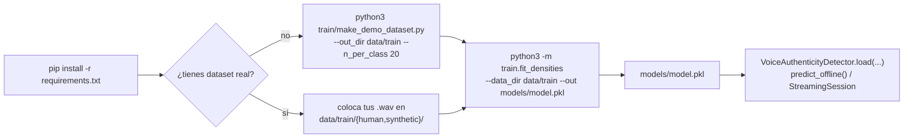

# Cómo ejecutar

Guía práctica para instalar dependencias, entrenar el modelo y usarlo
desde código. Este repo solo contiene el modelo y el entrenamiento (sin
API ni dashboard), así que todo el uso es vía Python.

## Diagrama de flujo de comandos



## 1. Instalación

```bash
python3 -m venv .venv && source .venv/bin/activate   # opcional pero recomendado
pip install -r requirements.txt
```

Requiere Python 3.10+ (usa sintaxis `list[dict]` / `X | None`).

## 2. Estructura del proyecto

```
detector/
├── features/
│   ├── acoustic.py         # x_a: spectral flatness, entropía, MFCC, fase, jitter, shimmer, pausas
│   └── behavioral.py        # x_b: latencia de reacción, varianza online, overlap, backchannels
├── preprocessing/
│   ├── vad.py                # VAD por energía (fallback si no hay turns.json)
│   ├── diarization.py        # arma turnos {channel,start,end} a partir de VAD estéreo
│   └── augmentation.py       # aumento de datos: ruido, códec, banda telefónica, etc.
├── model/
│   ├── density.py            # DiagonalGaussian + BlockDensityModel (LLR + atribución)
│   ├── llr.py                 # ScoreAccumulator: score(t) acumulado, por bloque y por feature
│   ├── calibration.py        # sigmoide+prior y StackingCalibrator (logística 2D estandarizada)
│   ├── online_update.py      # NIGState: actualización bayesiana exacta (mu,sigma2)
│   └── pipeline.py           # VoiceAuthenticityDetector (el "binario") + StreamingSession
├── train/
│   ├── fit_densities.py      # entrena y guarda models/model.pkl
│   ├── metrics.py            # Brier, ECE, IC bootstrap del AUC
│   └── make_demo_dataset.py  # genera un dataset sintético de prueba (NO son voces reales)
├── data/train/{human,synthetic}/  # dataset de entrenamiento
├── models/model.pkl          # binario entrenado (incluido de ejemplo en este repo)
└── requirements.txt
```

## 3. Generar un dataset de prueba (opcional, sin datos reales)

Para validar que todo el pipeline corre antes de conectar un dataset real:

```bash
python3 train/make_demo_dataset.py --out_dir data/train --n_per_class 20
```

Esto genera audio **sintetizado matemáticamente** (no voces reales) con
diferencias controladas en jitter/shimmer/coherencia de fase/latencias,
solo para probar la tubería end-to-end. El repo ya incluye un dataset de
ejemplo pequeño en `data/train/`.

## 4. Entrenar el modelo

```bash
python3 -m train.fit_densities \
    --data_dir data/train \
    --out models/model.pkl \
    --prior_h1 0.3 \
    --n_folds 5 \
    --n_repeats 20 \
    --n_augments 4
```

Con un dataset más grande (cientos de llamadas), un ejemplo más "a fondo"
probando además el hiperparámetro de regularización del stacking:

```bash
python3 -m train.fit_densities \
    --data_dir data/train \
    --out models/model.pkl \
    --n_repeats 30 \
    --n_augments 6 \
    --stacking_C_grid "0.1,0.3,0.5,1.0,2.0"
```

Argumentos:

| Flag | Default | Significado |
|---|---|---|
| `--data_dir` | `data/train` | Carpeta con subcarpetas `human/` y `synthetic/` |
| `--out` | `models/model.pkl` | Ruta de salida del binario entrenado |
| `--prior_h1` | `0.3` | Prior `p(voz sintética)` usado por el fallback bayesiano |
| `--n_folds` | `5` | Folds de la validación cruzada por llamada, en CADA repetición |
| `--n_repeats` | `20` | Repeticiones de la validación cruzada, cada una con una partición en folds distinta (semilla `seed+rep`). Esto es lo que da estabilidad al AUC reportado — no son "épocas", el modelo no usa descenso de gradiente |
| `--seed` | `42` | Semilla base; la repetición `r` usa `seed + r` |
| `--n_augments` | `4` | Variantes aumentadas (condición de canal/entorno) generadas por llamada. `0` desactiva la augmentación por completo |
| `--augment_seed` | `--seed` | Semilla de la augmentación. Se genera UNA sola vez por llamada (no se regenera en cada fold/repetición) |
| `--stacking_C_grid` | `"0.5"` | Uno o varios valores de `C` (regularización de la logística de stacking), separados por coma. Si se pasa más de uno, se corre la CV repetida completa para cada valor y se usa el de mayor AUC promedio |
| `--feature_auc_margin` | `0.03` | `|AUC-0.5|` mínimo para que una feature se mantenga activa en el LLR |
| `--min_features_acoustic` | `8` | Mínimo de features acústicas a conservar aunque no superen el margen |
| `--min_features_behavioral` | `2` | Mínimo de features comportamentales a conservar aunque no superen el margen |
| `--ece_bins` | `10` | Número de bins para el Expected Calibration Error |
| `--n_bootstrap` | `2000` | Remuestras para el intervalo de confianza del AUC final |
| `--plots_dir` | `reports` | Carpeta donde se guardan las gráficas PNG de diagnóstico. Pasa `--plots_dir ""` para desactivarlas |

Al terminar imprime un reporte con: AUC OOF (+ intervalo de confianza por
bootstrap), AUC media ± std ENTRE repeticiones de CV (la métrica de
estabilidad real), accuracy, matriz de confusión, Brier score, ECE, y los
pesos del stacking — y guarda `models/model.pkl`.

### Sobre la augmentación (`--n_augments`)

Cada llamada real se acompaña, SOLO durante el entrenamiento de cada fold
(nunca en validación), de variantes con una condición de canal/entorno
distinta: ruido a distintos SNR, ancho de banda tipo telefonía fija
(300-3400 Hz), códec mu-law (G.711), pérdida de paquetes VoIP,
reverberación leve, y cambios de ganancia — solas o combinadas (ver
`preprocessing/augmentation.py`). Deliberadamente NO se usa pitch-shift ni
time-stretch: alterarían jitter/shimmer y la coherencia de fase armónica,
que son justo las features que distinguen voz humana de sintética. Cada
variante se trata como más evidencia de la MISMA llamada (mismo
`group_id`) para el shrinkage de varianza — nunca como una llamada nueva
independiente, y nunca se filtra a validación.

### Sobre la validación cruzada repetida (`--n_repeats`)

Este modelo no se entrena por descenso de gradiente, así que "iterar más"
no significa más épocas: significa repetir la validación cruzada con
particiones distintas para ver qué tan estable es el resultado. Cada
repetición cubre el 100% de las llamadas exactamente una vez (out-of-fold)
con una partición en folds distinta. El AUC final reportado es el
calculado sobre el promedio de esos scores OOF entre repeticiones, y
además se reporta la media ± std del AUC de cada repetición individual:
una std alta avisa que, con el tamaño actual del dataset, el número
todavía depende demasiado de qué llamadas cayeron en cada partición.

## 4.1. Gráficas de diagnóstico generadas

Cada corrida de `train/fit_densities.py` genera automáticamente hasta 7
PNGs en `--plots_dir` (por defecto `reports/`):

| Archivo | Qué muestra |
|---|---|
| `confusion_matrix.png` | Matriz de confusión sobre el vector OOF |
| `roc_curve.png` | Curva ROC (OOF), con el punto operativo marcado en `eta` |
| `score_distribution.png` | Histograma del `score_total` por clase, con la línea del umbral `eta` |
| `llr_scatter.png` | Dispersión `LLR_acústico` vs `LLR_comportamental` por llamada, con la frontera de decisión del stacking logístico |
| `llr_block_distributions.png` | Histograma del LLR de cada bloque por separado, por clase |
| `cv_repeat_stability.png` | Un punto por repetición de CV: qué tan estable es el AUC entre particiones distintas |
| `calibration_reliability.png` | Diagrama de confiabilidad: confianza reportada vs. tasa real de aciertos, con el ECE |

Estas gráficas se generan a partir del código en `train/plots.py` (usa
matplotlib con backend `Agg`, sin necesidad de pantalla — funciona igual
en un servidor o en CI). Se recomienda NO versionarlas en git (ver
`README_COMMITS.md`), ya que se regeneran en cada entrenamiento.

## 5. Uso programático (cargar y predecir)

```python
from model.pipeline import VoiceAuthenticityDetector

detector = VoiceAuthenticityDetector.load("models/model.pkl")

# offline (llamada completa)
result = detector.predict_offline("ruta/a/llamada.wav")
print(result["is_synthetic"], result["confidence"])

# streaming (tiempo real, chunk a chunk)
session = detector.new_session()
snap = session.push_audio_chunk(audio_chunk_np, sr=16000)  # cada ~1s de audio del caller
snap = session.push_turn_event(t_evento, x_b_vector)        # cuando ocurre un evento de turno
estado_actual = session.current_snapshot()                  # score, confianza, veredicto en cualquier momento
resultado_final = session.final_result()                    # al colgar la llamada
```

El binario es **portable**: se carga con
`VoiceAuthenticityDetector.load("models/model.pkl")` desde cualquier
script (incluida una futura API/dashboard, que no forma parte de este
repo) — no hace falta volver a correr el entrenamiento.

## 6. Actualización online (sin reentrenar desde cero)

```python
from model.online_update import online_update_block

# X_h0_nuevas, X_h1_nuevas: arrays de nuevas llamadas etiquetadas (mismo
# formato que las usadas en entrenamiento) para el bloque acústico
online_update_block(detector.acoustic_block, X_h0_nuevas, X_h1_nuevas)
detector.save("models/model.pkl")
```

Usa un prior conjugado Normal-Inverse-Gamma por dimensión — el posterior
es exacto, no un promedio heurístico (ver `README.md`, sección 7).
