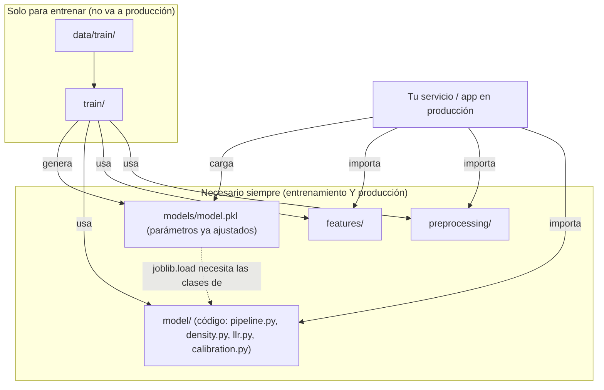

# Implementación — qué se necesita para usar el modelo ya entrenado

Este documento responde a la pregunta que más confusión genera: **"¿una
vez entrenado, solo necesito el `model.pkl`, o también otras carpetas?"**
Respuesta corta: **no basta con el `.pkl`**. Necesitas llevar también el
código de `preprocessing/`, `features/` y `model/` a donde sea que se
despliegue el detector. Aquí se explica por qué y cómo integrarlo.

## 1. Qué es (y qué NO es) el archivo `model.pkl`

`models/model.pkl` es el objeto `VoiceAuthenticityDetector` serializado
con `joblib`. Contiene **únicamente números ya ajustados**:

- medias y varianzas de las gaussianas H0/H1 de cada bloque
  (`model/density.py::DiagonalGaussian`),
- los pesos del stacking logístico (`w_acoustic`, `w_behavioral`, `bias`),
- el umbral de decisión `eta`,
- el prior `p(H1)` y metadatos del entrenamiento (`train_report`).

**No contiene código de procesamiento de audio.** No sabe leer un WAV, no
sabe diarizar, no sabe calcular un MFCC. Es solo el resultado de haber
ajustado esas gaussianas con `train/fit_densities.py` — el equivalente a
guardar únicamente los pesos de una red neuronal sin guardar la
arquitectura que los usa.

## 2. Carpetas que SIEMPRE se necesitan (entrenamiento y producción)

| Carpeta | Rol en producción |
|---|---|
| `model/` | `pipeline.py` orquesta todo (carga el `.pkl`, corre inferencia offline o streaming); `density.py`, `llr.py`, `calibration.py`, `online_update.py` contienen las **clases** que `joblib` necesita para poder reconstruir el objeto guardado en el `.pkl` (sin estas clases definidas en el código, `joblib.load()` falla). |
| `preprocessing/` | `vad.py` + `diarization.py`: convierten el WAV nuevo en turnos de habla `{channel, start, end}`, necesarios para el bloque comportamental. |
| `features/` | `acoustic.py` + `behavioral.py`: convierten audio + turnos en los vectores `x_a`/`x_b` que sí puede evaluar el modelo. |
| `models/model.pkl` | Los parámetros ya ajustados. |

Sin estas 3 carpetas de código, el `.pkl` es un archivo inútil.

## 3. Carpetas que SOLO se usan una vez, al entrenar

| Carpeta | Rol |
|---|---|
| `train/` | Genera el `.pkl` a partir del dataset. Una vez entrenado, no hace falta correrlo de nuevo (salvo reentrenamiento o actualización online). |
| `data/train/` | El dataset etiquetado usado para ajustar las gaussianas. No se necesita en producción. |

Si vas a empaquetar el detector para un despliegue (ej. un contenedor
Docker, una librería interna, un servicio), en principio podrías dejar
fuera `train/` y `data/train/` — aunque en este repo se mantienen juntos
porque es un solo proyecto de referencia.

## 4. Diagrama: qué se lleva a producción



## 5. Cómo se integra en un sistema propio

Ejemplo mínimo de integración (offline, una llamada completa):

```python
from model.pipeline import VoiceAuthenticityDetector

detector = VoiceAuthenticityDetector.load("models/model.pkl")
result = detector.predict_offline("llamada_nueva.wav")
print(result["is_synthetic"], result["confidence"])
```

Todo el preprocesamiento (resample a 16 kHz, diarización, extracción de
`x_a`/`x_b`) ocurre **dentro** de `predict_offline`, orquestado por
`model/pipeline.py` llamando a `preprocessing/` y `features/` — tu código
externo nunca necesita llamar esas carpetas directamente, solo necesita
tenerlas disponibles en el `PYTHONPATH`/paquete instalado.

## 6. Simulación de streaming (correr todo el proceso junto)

Para simular una llamada en vivo (como correría en un despliegue real,
alimentada segundo a segundo), usa `StreamingSession` a través de
`feed_full_call` con `realtime=True` — internamente llama a
`preprocessing/`, `features/` y `model/` en el mismo orden que un
despliegue real, sin ningún atajo de "modo demo":

```python
from model.pipeline import VoiceAuthenticityDetector, load_wav_any, split_channels
from preprocessing.diarization import diarize_stereo

detector = VoiceAuthenticityDetector.load("models/model.pkl")

signal, sr = load_wav_any("llamada.wav")          # preprocessing implícito: resample a 16kHz
caller, agent = split_channels(signal)
turns = diarize_stereo(signal, sr)                 # preprocessing/diarization.py

session = detector.new_session()
session.feed_full_call(caller, sr, turns, realtime=True)  # respeta los tiempos reales (duerme entre pasos)

resultado = session.final_result()
print(resultado["is_synthetic"], resultado["confidence"])
for snap in resultado["history"]:
    print(snap["t"], snap["block"], snap["llr_increment"], snap["score_cum"])
```

`realtime=True` hace que el método duerma entre segmentos respetando la
duración real de la llamada — es la misma ruta de código que un
despliegue en vivo, solo que alimentada desde un WAV grabado en vez de un
socket de audio en tiempo real. Si tu equipo necesita un script de línea
de comandos que envuelva esto (ej. `python simulate_call.py llamada.wav`
imprimiendo el score paso a paso), es una extensión sencilla sobre este
mismo código — pídelo aparte si lo necesitan.

## 7. Interpretabilidad: sigue intacta

Quitar `api/` y `dashboard/` de este repo no afecta la interpretabilidad
del modelo — esa vive en `model/density.py` y `model/llr.py`, que no se
tocaron:

- `BlockDensityModel.llr_attribution(x)` da la contribución exacta de
  cada feature individual al LLR (no una aproximación tipo SHAP).
- `ScoreAccumulator` guarda un `history` con cada incremento de score, de
  qué bloque vino y el desglose por feature.
- El stacking final son solo 2 pesos + un bias sobre 2 números
  (`LLR_acústico`, `LLR_comportamental`), trazables a mano.

Lo único que se pierde al no incluir `dashboard/` es la
**visualización en vivo** de esos datos (el gráfico apilado por bloque) —
los datos para reconstruirla siguen disponibles en
`session.final_result()["history"]`.

## 8. Resumen — checklist de despliegue

- [ ] Copiar `preprocessing/`, `features/`, `model/` (código) al entorno
      de destino.
- [ ] Copiar `models/model.pkl` (o la versión más reciente reentrenada).
- [ ] Instalar `requirements.txt`.
- [ ] Verificar que el `PYTHONPATH` incluya la raíz del proyecto (para
      que `from model.pipeline import ...` y `from features.acoustic
      import ...` resuelvan correctamente — los imports internos son
      absolutos, no relativos).
- [ ] **No** es necesario llevar `train/` ni `data/train/` a producción.
