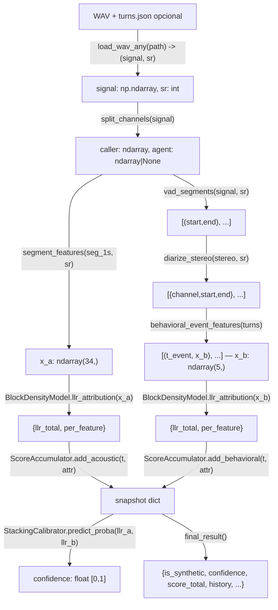

# Inputs y outputs

Contrato exacto de entradas y salidas de cada pieza del sistema, del nivel
más bajo (audio crudo) al más alto (resultado final del detector).

## Diagrama de contratos (qué entra y qué sale de cada pieza)



## Formato de datos crudos

### Audio
- **Input físico**: archivo `.wav`, estéreo, **cualquier sample rate de
  origen** — siempre se resamplea automáticamente a **16 kHz** antes de
  procesar nada más (`TARGET_SR` en `model/pipeline.py`). Canal 0 =
  caller, canal 1 = agente.
- Cargado con `load_wav_any(path_or_bytes, target_sr=16000)` →
  `(signal: np.ndarray, sr: int)`. Acepta path, `bytes` o file-like.
- `split_channels(signal)` → `(caller: np.ndarray, agent: np.ndarray | None)`.

### Turnos (`*.turns.json`)
```json
{"turns": [{"channel": 0, "start": 1.42, "end": 2.86}, ...]}
```
- `channel`: `0` (caller) o `1` (agente).
- `start`, `end`: segundos, float.
- Archivo opcional por llamada; si no existe, se auto-diariza (ver
  `README_PROCESAMIENTO.md`). Ejemplo completo en
  `data/example_turns_format.json`.

### Dataset de entrenamiento (`data/train/`)
```
data/train/
├── human/
│   ├── call001.wav
│   ├── call001.turns.json   (opcional)
│   └── ...
└── synthetic/
    ├── call101.wav
    ├── call101.turns.json
    └── ...
```
El label (humano=0 / sintético=1) se toma del nombre de la carpeta.

## Features

### `features/acoustic.py::segment_features(signal, sr)`
- **Input**: `signal` (np.ndarray, 1D, un segmento de ~1s del canal
  caller), `sr` (int, 16000).
- **Output**: `x_a`, np.ndarray de 34 dimensiones, orden fijo en
  `ACOUSTIC_FEATURE_NAMES`:
  `spectral_flatness_{mean,std}`, `spectral_entropy_{mean,std}`,
  `harmonic_phase_coherence_mean`, `mfcc{1..13}_mean`, `mfcc{1..13}_var`,
  `jitter_local`, `shimmer_local`, `pause_naturalness`.

### `features/behavioral.py::behavioral_event_features(turns)`
- **Input**: `turns`, lista de dicts `{channel, start, end}` (toda la
  llamada).
- **Output**: lista de tuplas `(t_event: float, x_b: np.ndarray)`, una por
  evento de turno detectado, en orden temporal. `x_b` tiene 5 dimensiones
  (`BEHAVIORAL_FEATURE_NAMES`): `reaction_latency`,
  `recovery_latency_running_var`, `is_overlap`, `backchannel_present`,
  `backchannel_timing`.

## Preprocesamiento

### `preprocessing/vad.py::vad_segments(signal, sr)`
- **Input**: señal mono de un canal, `sr`.
- **Output**: lista de tuplas `(start: float, end: float)` en segundos —
  intervalos con energía por encima del umbral.

### `preprocessing/diarization.py::diarize_stereo(stereo, sr)`
- **Input**: `stereo`, np.ndarray de forma `(n_samples, 2)` o `(2,
  n_samples)`.
- **Output**: lista de dicts `{channel, start, end}` (mismo formato que
  `turns.json`), ordenada cronológicamente.

## Modelo

### `model/density.py::BlockDensityModel`
- `fit(X_h0, X_h1)` — **input**: dos matrices `(n_muestras, n_dims)`,
  features del bloque bajo H0 y H1. Sin output (ajusta en sitio).
- `llr(x)` — **input**: vector `x` de `n_dims`. **Output**: `float`
  (LLR total del bloque para esa muestra).
- `llr_attribution(x)` — **input**: igual. **Output**: dict
  `{"llr_total": float, "per_feature": {nombre_feature: float, ...}}`.

### `model/calibration.py::StackingCalibrator`
- `fit(llr_a, llr_b, y)` — **input**: arrays `(n_llamadas,)` de LLR
  acústico total, LLR comportamental total, y label (0/1) por llamada.
- `predict_proba(llr_a, llr_b)` — **input**: dos floats. **Output**:
  `float` en `[0,1]` (probabilidad calibrada de H1).

### `model/llr.py::ScoreAccumulator`
- `add_acoustic(t, attribution)` / `add_behavioral(t, attribution,
  event_meta=None)` — **input**: `t` (float, segundos), `attribution`
  (dict como el de `llr_attribution`). **Output**: snapshot dict:
  ```json
  {"t": float, "block": "acoustic"|"behavioral", "llr_increment": float,
   "per_feature": {...}, "llr_acoustic_cum": float,
   "llr_behavioral_cum": float, "score_cum": float, "event_meta": null}
  ```

### `model/online_update.py::online_update_block(block, X_h0_new, X_h1_new)`
- **Input**: un `BlockDensityModel` ya entrenado + matrices de nuevas
  observaciones etiquetadas por hipótesis.
- **Output**: ninguno explícito; actualiza `block.h0` / `block.h1` en
  sitio vía posterior Normal-Inverse-Gamma exacto.

### `model/pipeline.py::VoiceAuthenticityDetector`
- `predict_offline(path_or_bytes, turns=None)` — **input**: WAV (path,
  bytes o file-like) + turnos opcionales. **Output**:
  ```json
  {"is_synthetic": true, "confidence": 0.87, "score_total": 4.21,
   "llr_acoustic_cum": 3.0, "llr_behavioral_cum": 1.21,
   "n_acoustic_segments": 42, "n_behavioral_events": 7, "eta": 1.5,
   "history": [ ... snapshots ... ]}
  ```
- `new_session()` — **output**: objeto `StreamingSession`.

### `model/pipeline.py::StreamingSession`
- `push_audio_chunk(chunk, sr)` — **input**: np.ndarray de audio nuevo del
  caller, `sr`. **Output**: snapshot (ver `ScoreAccumulator`) o `None` si
  aún no se completó 1s.
- `push_turn_event(t_event, x_b, event_meta=None)` — **input**: tiempo del
  evento, vector `x_b` (5 dims), metadata opcional. **Output**: snapshot.
- `current_snapshot()` — **output**: dict con `t`, `score_total`,
  `llr_acoustic_cum`, `llr_behavioral_cum`, `n_acoustic_segments`,
  `n_behavioral_events`, `confidence`, `confidence_bayes_fallback`,
  `is_synthetic`, `eta`.
- `final_result()` — **output**: igual formato que `predict_offline`.

## Entrenamiento

### `train/fit_densities.py` (CLI)
- **Input**: `--data_dir` (carpeta `human/`+`synthetic/`), `--out` (ruta
  `.pkl`), `--prior_h1`, `--n_folds`, `--n_repeats` (repeticiones de la CV
  con particiones distintas), `--seed`, `--n_augments` (variantes
  aumentadas por llamada; `0` desactiva), `--augment_seed`,
  `--stacking_C_grid` (uno o varios valores de `C`, separados por coma),
  `--feature_auc_margin`, `--min_features_acoustic`,
  `--min_features_behavioral`, `--ece_bins`, `--n_bootstrap`,
  `--plots_dir` (carpeta para las gráficas PNG, `""` para desactivarlas).
- **Output**: archivo `models/model.pkl` (un `VoiceAuthenticityDetector`
  serializado con `joblib`) + reporte impreso en consola (AUC OOF con IC
  bootstrap, AUC media±std ENTRE repeticiones de CV, accuracy, matriz de
  confusión, Brier score, ECE, pesos del stacking). El mismo reporte
  queda guardado dentro del binario en `detector.train_report`, incluyendo
  además `augmentation` (metadatos de la augmentación), `stacking_C` (el
  elegido), `stacking_C_grid_results` (si se probó más de un valor),
  `cv_repeat_aucs` (lista completa), y `feature_keep_frequency_acoustic` /
  `_behavioral` (qué tan seguido se mantuvo cada feature entre folds y
  repeticiones — 1.0 = siempre se mantuvo, 0.0 = nunca). Además, 7 PNGs
  de diagnóstico en `--plots_dir` (ver `train/plots.py`):
  `confusion_matrix.png`, `roc_curve.png`, `score_distribution.png`,
  `llr_scatter.png`, `llr_block_distributions.png`,
  `cv_repeat_stability.png`, `calibration_reliability.png`.

### `train/plots.py::generate_all_plots(out_dir, cm, val_y, val_scores, auc, eta, all_llr_a, all_llr_b, all_y, train_mask, calibrator, repeat_aucs=None, ece_report=None)`
- **Input**: todos los arrays/objetos ya calculados por
  `train/fit_densities.py` (no recalcula nada, solo grafica). `repeat_aucs`
  y `ece_report` son opcionales; si se omiten, simplemente no se generan
  `cv_repeat_stability.png` ni `calibration_reliability.png`.
- **Output**: lista de `Path` a los PNG generados en `out_dir` (5 o 7,
  según si se pasaron `repeat_aucs`/`ece_report`).

### `preprocessing/augmentation.py::generate_augmented_variants(signal, sr, rng, n_variants)`
- **Input**: señal mono del caller (float64), sample rate, un
  `numpy.random.Generator` con semilla fija, y cuántas variantes generar.
- **Output**: lista de `(tag, señal_aumentada)` — cada una con una
  condición de canal/entorno distinta (ruido, ancho de banda telefónico,
  códec mu-law, pérdida de paquetes, reverberación leve, ganancia, o
  combinaciones). No inventa contenido nuevo: es la MISMA grabación bajo
  otra condición de canal.

### `train/metrics.py`
- `brier_score(y, p)` — **input**: etiquetas reales y probabilidades
  predichas. **output**: float, menor es mejor calibración.
- `expected_calibration_error(y, p, n_bins=10)` — **output**: dict con
  `ece` (float) y `bins` (detalle por bin, usado para el diagrama de
  confiabilidad).
- `bootstrap_auc_ci(y, score, n_boot=2000, alpha=0.05, seed=0)` —
  **output**: dict con `ci_low`, `ci_high`, `median`, `n_valid_boot`
  (remuestreo por llamada, no por segmento).

### `train/make_demo_dataset.py` (CLI)
- **Input**: `--out_dir`, `--n_per_class`.
- **Output**: WAVs sintéticos + `.turns.json` escritos en
  `out_dir/{human,synthetic}/`, para poder correr todo el pipeline sin
  datos reales.
