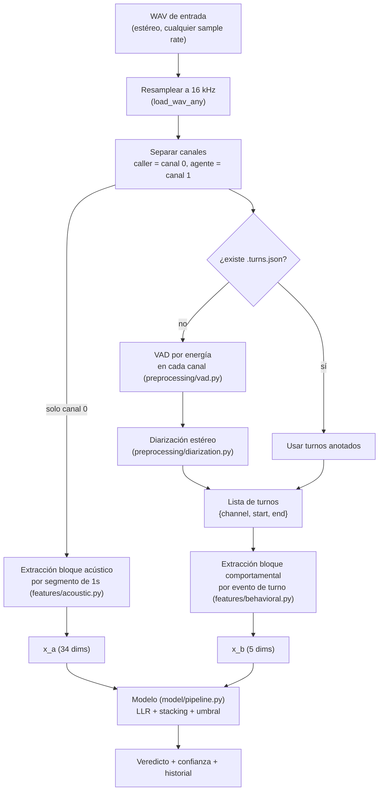
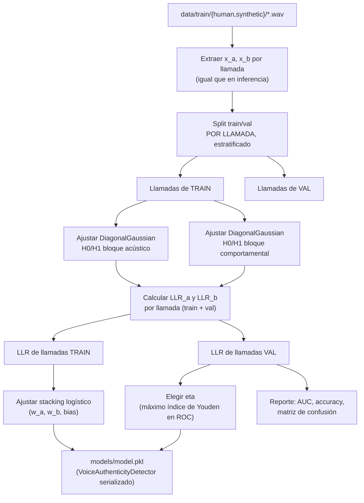
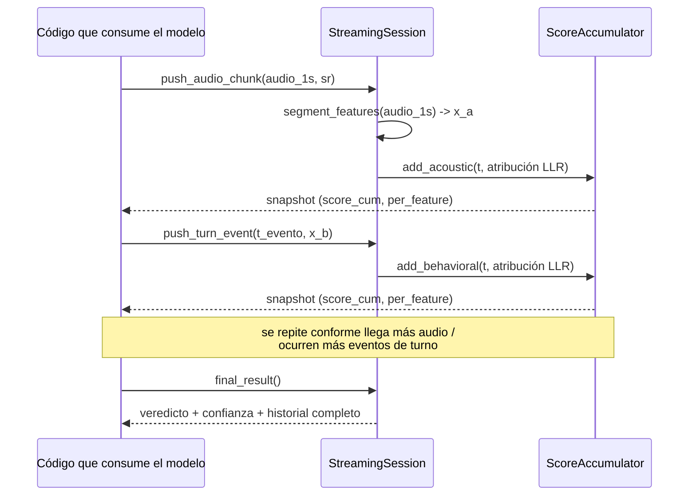

# Procesamiento de datos — de audio crudo a decisión

Este documento describe **cómo debe procesarse la información** a través
del sistema, en el orden exacto en que ocurre, tanto en entrenamiento como
en inferencia. Para el fundamento matemático de cada paso ver `README.md`;
para el contrato exacto de tipos de entrada/salida ver
`README_INPUTS_OUTPUTS.md`.

## Diagrama general del procesamiento

## 0. Requisito de formato de audio

- WAV **estéreo**, se trabaja siempre a **16 kHz**.
- Canal 0 = caller (la persona a evaluar).
- Canal 1 = agente (solo se usa para diarizar turnos, nunca para features
  acústicas).
- El audio puede llegar grabado a **cualquier frecuencia de muestreo**
  (8 kHz, 16 kHz, 44.1 kHz, etc.) — `load_wav_any` lo resamplea siempre a
  16 kHz (`TARGET_SR` en `model/pipeline.py`) antes de cualquier otro
  paso, tanto en entrenamiento como en inferencia. Esto garantiza que el
  modelo nunca vea dos llamadas a resoluciones distintas.
- Si el WAV es mono, se trata todo como canal del caller y no hay
  diarización comportamental posible (solo bloque acústico).

## 1. Diarización (obtener turnos de habla)

Antes de poder calcular el bloque comportamental hace falta saber **cuándo
habla cada canal** (turnos `{channel, start, end}`):

1. Si la llamada trae un archivo `*.turns.json` con turnos anotados
   manualmente, se usan esos (son más precisos).
2. Si no existe, se auto-diariza con `preprocessing/diarization.py`:
   - Se corre un **VAD por energía** (`preprocessing/vad.py`)
     independientemente en cada canal.
   - Cada segmento de energía sostenida por encima del umbral se reporta
     como un turno de ese canal.
   - Los turnos de ambos canales se combinan y se ordenan
     cronológicamente.

Este paso es el mismo tanto en entrenamiento (`train/fit_densities.py`)
como en inferencia (`model/pipeline.py`), así que el modelo nunca ve un
tipo de turnos distinto al de entrenamiento.

## 2. Extracción del bloque acústico (`x_a`)

Solo usa el canal 0 (caller), y se procesa en dos niveles anidados:

1. **Nivel frame** (25 ms, hop 10 ms): sobre cada frame se calculan
   planitud espectral, entropía espectral y coherencia de fase armónica
   frame a frame (además de un frame de 40 ms/hop 20 ms específico para
   estimar F0 y de ahí jitter/shimmer).
2. **Nivel segmento** (agregación cada 1.0 s, `SEGMENT_SECONDS`): las
   pistas frame-a-frame se agregan (media/std) dentro del segmento, se
   calculan MFCCs (media + varianza) sobre el segmento completo, y se
   agregan jitter, shimmer y naturalidad de pausas — todo en un único
   vector `x_a` de 34 dimensiones (ver `ACOUSTIC_FEATURE_NAMES`).

Este vector `x_a` es la unidad mínima de evidencia acústica: se produce
uno por cada segundo de audio del caller, tanto en entrenamiento (por cada
llamada, muchos segmentos) como en inferencia (uno cada vez que llega 1s
de audio nuevo).

## 3. Extracción del bloque comportamental (`x_b`)

A partir de la lista de turnos (paso 1):

1. **Fusión de turnos**: turnos consecutivos del mismo canal separados por
   huecos menores a 0.5 s se fusionan en uno solo (evita contar
   fragmentación del VAD como reacciones separadas).
2. **Clasificación de eventos de turno**: cada vez que un turno de agente
   es seguido por un turno del caller, se genera un "evento de turno" con:
   - latencia de reacción (negativa si el caller interrumpió/solapó),
   - si hubo solape,
   - si hubo un backchannel corto del caller durante el turno del agente,
     y en qué momento relativo del turno del agente ocurrió.
3. **Vector `x_b`** por evento: se arma con la latencia, la varianza
   incremental (Welford) de latencias observadas hasta ese evento en la
   llamada, y los tres indicadores anteriores — 5 dimensiones
   (`BEHAVIORAL_FEATURE_NAMES`).

A diferencia del bloque acústico (uno por segundo fijo), el bloque
comportamental produce **un vector por evento de turno**, que ocurre a
ritmo variable según la conversación.

## 4. Procesamiento en entrenamiento (`train/fit_densities.py`)

1. Recorrer `data/train/human/` y `data/train/synthetic/`, cargar cada WAV
   y sus turnos (anotados o auto-diarizados).
2. Extraer todos los `x_a` (por segmento) y `x_b` (por evento) de cada
   llamada.
3. Separar llamadas en train/val **por llamada completa** (no por
   segmento), de forma estratificada por clase.
4. Agrupar todos los `x_a` de llamadas humanas de train → ajustar
   `DiagonalGaussian` H0 del bloque acústico. Igual con `x_a` de
   sintéticas → H1. Repetir para `x_b` → bloque comportamental.
5. Con las densidades ya ajustadas, calcular `LLR_acústico_total` y
   `LLR_comportamental_total` por llamada (sumando el LLR de cada
   segmento/evento de esa llamada), para **todas** las llamadas (train y
   val).
6. Ajustar el stacking logístico sobre los LLR de las llamadas de train.
7. Elegir `eta` (umbral) maximizando Youden sobre los scores de las
   llamadas de val.
8. Serializar todo (`VoiceAuthenticityDetector`) en `models/model.pkl`.

## 5. Procesamiento en inferencia (`model/pipeline.py`)

Modo **offline** (`predict_offline`, llamada completa de una sola vez):
carga el WAV, diariza si hace falta, y alimenta una `StreamingSession` de
principio a fin sin pausas — internamente hace exactamente el mismo
cómputo que el modo streaming.

Modo **streaming** (`StreamingSession`, incremental):
1. `push_audio_chunk(chunk, sr)`: acumula audio en un buffer interno; cada
   vez que se junta 1s completo, calcula `x_a` de ese segmento, obtiene su
   atribución LLR contra el bloque acústico, y la suma al score acumulado.
2. `push_turn_event(t, x_b)`: cuando ocurre un evento de turno, calcula su
   atribución LLR contra el bloque comportamental y la suma al score
   acumulado.
3. En cualquier momento, `current_snapshot()` da el estado actual (score,
   confianza vía stacking, veredicto contra `eta`).
4. Al terminar la llamada, `final_result()` da el resultado final más el
   historial completo de incrementos de score (para trazabilidad /
   auditoría de la decisión).

El mismo objeto `StreamingSession` sirve tanto para un despliegue real
(alimentado en vivo conforme llega audio de la llamada) como para simular
una llamada grabada a distintas velocidades.
